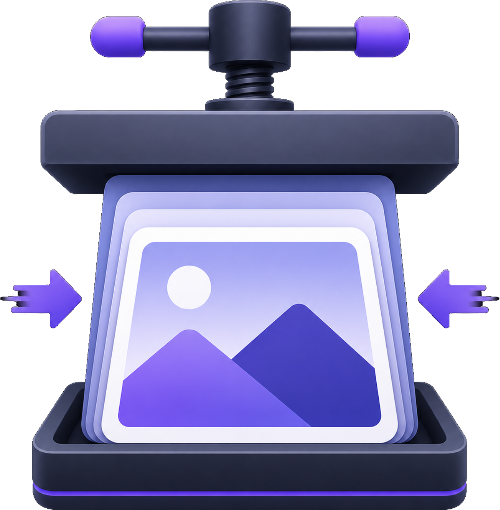
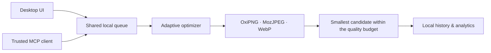

<p align="center">
  
</p>

<h1 align="center">FramePress</h1>

<p align="center">
  <strong>A local-first, MCP-enabled image optimizer for people and AI agents.</strong>
</p>

<p align="center">
  <a href="https://github.com/sumitgohil/framepress/actions/workflows/release.yml"></a>
  <a href="LICENSE"></a>
  
  
</p>

FramePress makes image optimization deliberate, observable, and private. Its native desktop app gives people a fast drag-and-drop workflow; its opt-in [Model Context Protocol (MCP)](https://modelcontextprotocol.io/) server gives trusted local AI clients the same capabilities through a carefully bounded interface.

No uploads. No account. No opaque cloud processing. Your images, history, analytics, and agent workflow stay on your machine.

> **Status:** macOS-first and actively developed. Cross-platform release builds are configured for Linux, Windows, Apple Silicon Macs, and Intel Macs.

## Why FramePress

| What matters                     | How FramePress approaches it                                                                                                                  |
| -------------------------------- | --------------------------------------------------------------------------------------------------------------------------------------------- |
| **Agent-ready, not agent-first** | MCP work enters the same queue, history, and analytics as work initiated from the desktop app.                                                |
| **Local control**                | The MCP server is opt-in, loopback-only, bearer-token protected, and limited to folders the user explicitly approves.                         |
| **Quality without guesswork**    | Multiple compatible encoders are evaluated and the smallest candidate that clears the selected visual-quality budget wins.                    |
| **Safe by default**              | Originals remain untouched, outputs are sibling files, and lossy results must save at least 5% before replacing the original in the workflow. |

## What you can do

### Optimize from the desktop

- Drop in individual files or folders; folder imports are recursive and de-duplicated.
- Optimize PNG, JPEG, and WebP with OxiPNG, MozJPEG, and WebP encoding paths.
- Choose intent-based presets: Lossless, Maximum Compression, Developer Assets, Website, Email, or Social Media.
- Preserve the original format or create optional WebP copies for PNG and JPEG inputs.
- Follow progress through a responsive queue with pause, resume, cancel, retry, and history views.
- Review local savings trends, biggest wins, and results grouped by format, preset, and source.

### Connect a trusted AI client through MCP

FramePress exposes an opt-in local endpoint for tools such as Codex, Claude Code, or Cursor. An agent can validate files, submit and monitor batches, retry or cancel jobs, make WebP copies, and query local history and statistics.

The integration is intentionally narrow:

- Listens on `127.0.0.1` only — never your network interface.
- Requires a configurable bearer token that can be rotated in Settings.
- Allows access only within directory roots approved by the desktop user.
- Cannot alter global safety settings or approve directories on its own.

Read the [MCP integration guide](docs/mcp.md) for setup, the connection flow, and tool details.

## How it works



1. FramePress detects the input format and resolves the selected preset.
2. It runs compatible encoding candidates and measures their output.
3. Lossy candidates are evaluated with a luminance-weighted YCbCr visual-distance score.
4. The smallest candidate within the preset's budget is selected; marginal savings keep the original instead.

The interface and MCP server share the same Rust services rather than separate implementations. That keeps behavior consistent and makes agent activity visible to the person in control.

## Architecture

```text
apps/desktop/              SvelteKit interface + Tauri v2 shell
crates/framepress-core/    queue, domain model, optimizer, engines, history
crates/framepress-api/     future programmatic API boundary
crates/framepress-cli/     future CLI boundary
docs/                      MCP guide and architectural decisions
```

The [architecture guide](ARCHITECTURE.md) explains the component boundaries and privacy model. Key design trade-offs are recorded in [ADRs](docs/adr/).

## Run it locally

### Prerequisites

- macOS 11+ (the development workflow is currently macOS-first)
- Rust 1.75+
- Node.js 20+
- pnpm 9+
- Xcode Command Line Tools, `cmake`, and `pkg-config`

### Development

```bash
pnpm install
cargo test --workspace
pnpm --filter @framepress/desktop check
pnpm --filter @framepress/desktop tauri:dev
```

The first build compiles native image libraries and can take a few minutes.

### Verify changes

```bash
cargo fmt --check
cargo test --workspace
pnpm --filter @framepress/desktop check
pnpm --filter @framepress/desktop test
pnpm format:check
```

## Releases

Pushing to `main` runs the release workflow. It builds installers for Linux, Windows, Apple Silicon macOS, and Intel macOS, then publishes them to the GitHub Release named after the version in `apps/desktop/src-tauri/tauri.conf.json`.

## Contributing

Bug reports, feature ideas, documentation improvements, and code contributions are welcome. Start with [CONTRIBUTING.md](CONTRIBUTING.md).

## License

FramePress is licensed under the [GNU General Public License v3.0 or later](LICENSE). Third-party libraries retain their own licenses.
